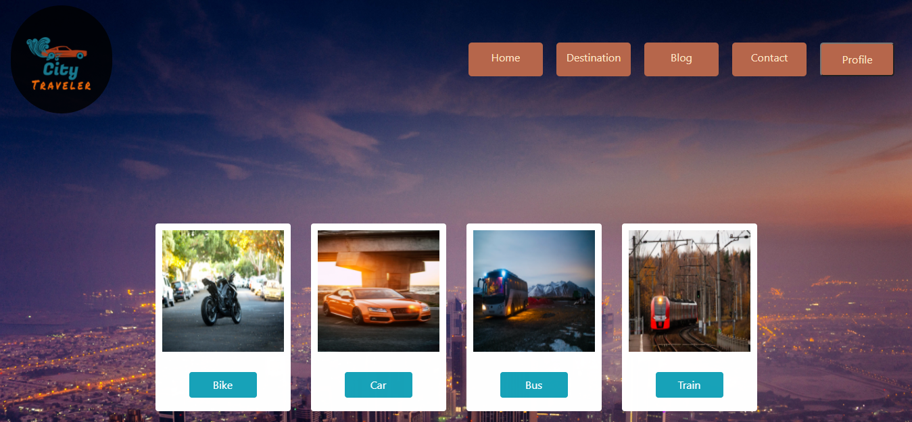

# City Traveler

> This is City Traveler project .

---

### Header:

- [Description](#description)
- [How To Use](#how-to-use)

---

## Description

You can choose the vehicle of your choice for city travel !!
Packages:  
1.Used React Framework, JavaScript
Language, Node.JS for
Backend, and MongoDB as database.  
2.Firebase for authentication.
 
3.React-bootstrap for style frontend side.
 
4.React hook form to get data from the form.

   
 Some features of my project:  
1.This site is responsive for mobile and Desktop.  
2.In home page you will see name of vehicle .    
3.Here I am use some npm package for style.  
4.You will see a destination page.which is private page.You can't se without login.  
5.I am use simple google map in destination page.  
6.I am create login page by firebase authentication.  

---

## How To Use

If you want download this project you can download zip file or clone this site.
After download you open the project in your IDE and open your terminal. Then for run this project you type in your terminal "yarn start".

---

## Live link:

-live server: - [City-Traveler](https://city-traveler-8b49e.web.app/)
